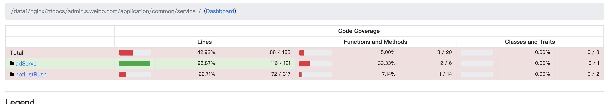
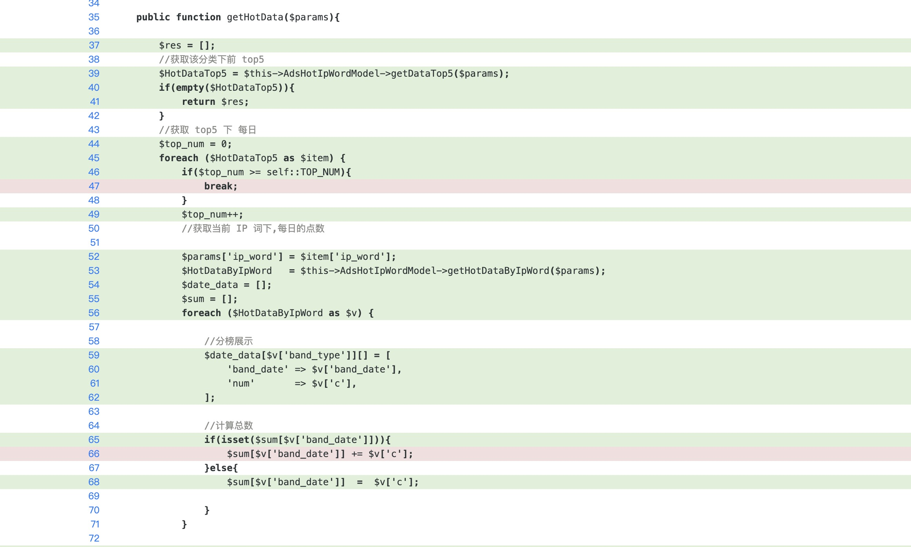

# 单元测试手册

### 环境配置

#### 环境地址：

registry.api.weibo.com/wbsearch/phpunit-php7.3:1.0.0

#### 基础配置

- 修改 test 目录下，Ainit.php文件 第一行和第二行 （gitrunner 路径设置问题）
- 项目根目录下 phpunit.xml ： 
  - testsuites :可以更改或则新增单元测试模块目录
  - coverage:可设置覆盖率覆盖的文件 or 目录；
  - report: 可以使用 html 方式来查看覆盖情况;

#### phpunit.xml

```xml
<?xml version="1.0" encoding="UTF-8"?>
<phpunit xmlns:xsi="http://www.w3.org/2001/XMLSchema-instance"
         xsi:noNamespaceSchemaLocation="https://schema.phpunit.de/9.6/phpunit.xsd"
         bootstrap="test/Ainit.php"
         executionOrder="depends,defects"
         forceCoversAnnotation="true"
         beStrictAboutOutputDuringTests="true"
         beStrictAboutTodoAnnotatedTests="true"
         convertDeprecationsToExceptions="true"
         failOnRisky="true"
         failOnWarning="true"
         verbose="true"
         colors="true">
    <testsuites>
        <testsuite name="default">
            <directory>test</directory>
        </testsuite>
    </testsuites>

    <coverage
            includeUncoveredFiles="false"
    >
        <include>
<!--            <directory suffix=".php">application/common/service/huati/</directory>-->
            <directory suffix=".php">application/common/service/hotListRush/</directory>
            <directory suffix=".php">application/common/service/adServe/hotIp/</directory>

        </include>
        <report>
            <cobertura outputFile="tmp/cobertura.xml"/>
            <html outputDirectory="tmp/" lowUpperBound="50" highLowerBound="90"/>
            <text outputFile="php://stdout" showUncoveredFiles="false" showOnlySummary="true"/>
        </report>
    </coverage>

    <logging>
        <junit outputFile="tmp/junit.xml"/>
        <text outputFile="php://stdout"/>
    </logging>
</phpunit>

```

### 基础应用

#### 第一步：

在 test 目录下，创建文件，以 Test 为后缀：

```
test/services/hotIp/AdsHotIpWordTest.php
```

#### 第二步：

引入单元测试类并继承

```php
use PHPUnit\Framework\TestCase; 
class AdsHotIpWordTest extends TestCase 
```

```php
use PHPUnit\Framework\TestCase;
class AdsHotIpWordTest extends TestCase //第一步
{

}
```


#### 第三步创建测试函数，以 test 为前缀 ： 

```php
  public  function testGetHotIpWordList(){}
```

### 高级应用

#### @dataProvider  

测试用例，数据供给器。多维数组，多个二层数组代表多个参数输入

```php
    /**
     * @dataProvider dataGetHotIpWordLists
     */
public  function testGetHotIpWordList($param1, $param2, $param3){}
```

```php
 public  function dataGetHotIpWordLists():array {
 		return [
      //测试用例一
      [
        //参数一
      	  [],
        //参数二
        '',
        //参数三
        123
      ]
    ];
 }
```


#### @covers 

要覆盖的类或者方法

```php
    /**
     * @dataProvider dataGetHotIpWordLists
     * @covers app\common\service\adServe\HotIp\AdsHotIpWord
     * @covers app\common\service\adServe\HotIp\AdsHotIpWord::getHotData
     * @covers app\common\service\adServe\HotIp\AdsHotIpWord::__construct
     */
     public  function testGetHotIpWordList(){}
```


#### mock 数据

- 在 function setUp() 中定义好需要 mock 的类以及函数
- $this->AdsHotIpWordModel = $this->getMockBuilder(AdsHotIpWordModel::class)->setMethods(['getDataTop5','getHotDataByIpWord','getIpWordList'])->getMock();
- 将 mock 的变量赋值给 service

```php
use PHPUnit\Framework\TestCase;
use app\common\model\sap\hotIp\AdsHotIpWord as AdsHotIpWordModel;
use app\common\service\adServe\hotIp\AdsHotIpWord;
class AdsHotIpWordTest extends TestCase //第一步
{
    private $service;
    private $AdsHotIpWordModel;
    public function setUp(): void
    {
        $this->service = new AdsHotIpWord();
        $this->AdsHotIpWordModel = $this->getMockBuilder(AdsHotIpWordModel::class)->setMethods(['getDataTop5','getHotDataByIpWord','getIpWordList','getKeyWordDataList'])->getMock();
    }
  
   public function testGetHotIpWordList($params, $equls, $dataReturn = []):void
   {
     //willReturn mock 的函数，要返回的值
      $this->AdsHotIpWordModel->method('getDataTop5')->willReturn($dataReturn['data']);
      $this->service->AdsHotIpWordModel = $this->AdsHotIpWordModel;
			$res =  $this->service->gethotIpWordList($params);
      $this->assertEquals($res, $equls);
   }
}
```

### 执行命令

在项目根目录下执行

```
./vendor/bin/phpunit
```

```
[root@92b0f0963e03 admin.s.weibo.com]# ./vendor/bin/phpunit
PHPUnit 9.6.3 by Sebastian Bergmann and contributors.

Runtime:       PHP 7.3.33 with Xdebug 3.1.6
Configuration: /data1/nginx/htdocs/admin.s.weibo.com/phpunit.xml

.............................                                                   15 / 15 (100%).                                                   15 / 15 (100%)

Time: 00:04.159, Memory: 22.00 MB

OK (15 tests, 15 assertions)

Generating code coverage report in Cobertura XML format ... done [00:00.087]

Generating code coverage report in HTML format ... done [00:01.087]


Code Coverage Report Summary:
  Classes:  0.00% (0/3)
  Methods: 15.00% (3/20)
  Lines:   42.92% (188/438)

```

在项目根目录下 tmp 文件夹生产了 index.html文件，可点击查看覆盖率情况





### 异常

- 执行目录，必须和 Ainit.php 文件配置的路径一致，否则覆盖率为 0
- 命名空间要和目录命名一致，包括大小写，否则覆盖率为 0

### 收益

#### 团队：

- 提高代码质量
- 修改他人代码，成本低
  - 有 mock 数据
  - 流程异常可及时发现

#### 个人：

- 单元测试写的快以及好，可以证明业务理解通透，代码模块抽象好
- 通过单元测试 mock 数据，减少数据库操作，开发快
- 通过单元测试 mock 三方接口，减少联调成本，开发快
